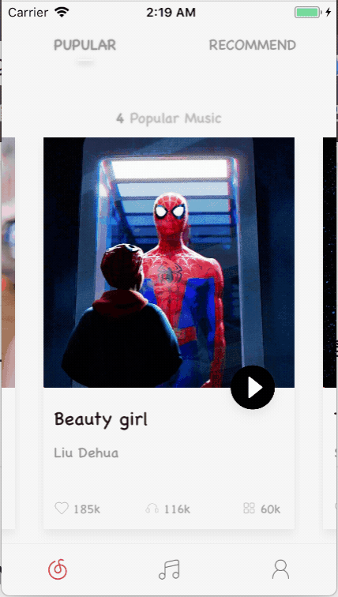
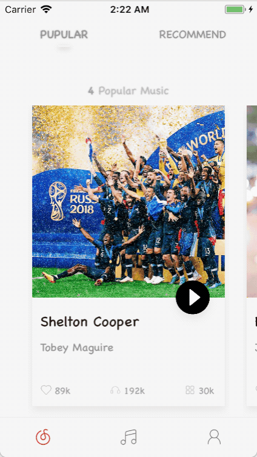
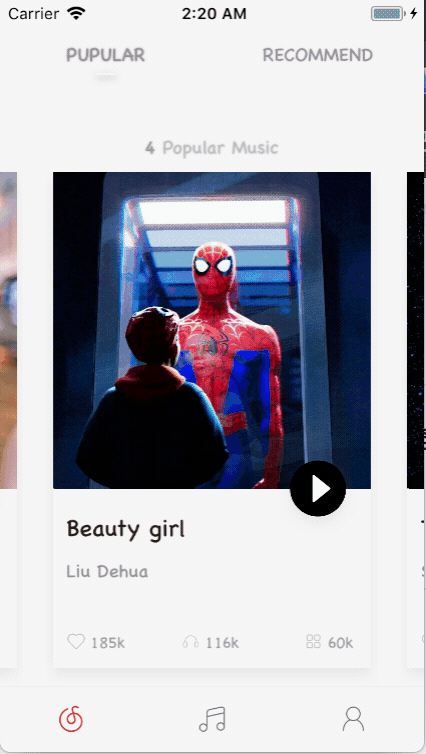
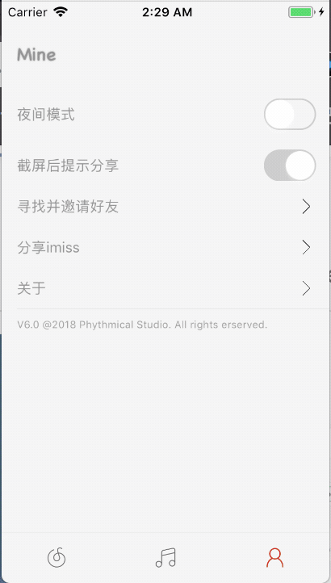

# imissMusic
基于 iOS 和 Python 开发的移动端音乐 App，界面参考 [UI设计](https://uimovement.com ) 组装起来的

## 预览
#### 首页欢迎页

#### 歌单列表

#### 播放页

#### 夜间模式

## 开发目的

一直想去写一个前后端自己开发的项目，虽然没写完，但是有那么点谱了。

## 技术栈

**iOS**

* `Method Swizzling `: 方法调配，控制夜间模式的切换
* `UIViewControllerTransitioning `: 自定义转场动画
* `AVPlayer `: 音乐播放器封装
* `pop `: 第三方动画库
* `Realm `: 第三方数据库
* `UMShare `: 第三方分享平台
* `AFNetworking`: 第三方网络框架
* `MJExtension `: 第三方数据解析
* `MBProgressHUD `: 第三方HUD弹框
* `JZNavigationExtension `: 第三方导航栏

## 实现功能
欢迎页面、歌单页面、我的页面、播放页面

### 欢迎页面
首页分为欢迎、推荐两部分，目前只写了欢迎页面，自定义转场动画，重写了CollectionView 的 Layout。

### 歌单页面
歌单页面分为两部分，包含歌单、歌曲，拖动、点击歌单切换歌曲列表，歌曲跳转歌曲详情暂无。

### 我的页面
简单的 Table 列表，包含夜间模式、截图分享等设置。

### 播放页面
重要的音乐播放器页面，实现显示歌词、歌曲进度等功能，可以切换图片和歌词。

## TODO
1. iOS -> 推荐页面编写
2. iOS -> 歌单页面跳转到播放页
3. iOS -> 夜间模式完善
4. Python -> 请求加密
5. Python -> 分享 API 添加
6. React -> React 端编写
7. Electron -> Electron 端编写

## 感谢
* 感谢 [UI设计](https://uimovement.com) 这个网站的存在

## 最后
如果觉得我的项目还不错的话 👏，就给个 star ⭐️ 鼓励一下吧~

## Build Setup
* 如果只运行iOS端，请先 `pod install`。
* 如果想运行 Python 端的话，请参考 [廖雪峰的Python教程](https://www.liaoxuefeng.com/wiki/0014316089557264a6b348958f449949df42a6d3a2e542c000/001432712108300322c61f256c74803b43bfd65c6f8d0d0000)，并将 iOS 中 Debug 属性改为 False。